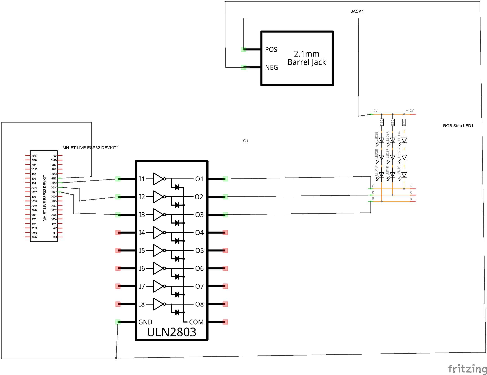

### **Wireless Control of RGB LED Strip**

### Introduction
Welcome to the presentation of my project, which combines electronics and programming for the wireless control of an RGB LED strip. The project involves using an ESP32 microcontroller, as well as developing a server with Node.js and a client site for color selection through a user-friendly interface.

### Project Goals
- **Understanding Basic Electronics Principles**: Connecting and controlling an RGB LED strip via the UNL2803 integrated circuit and the ESP32.
- **Programming and Networking**: Developing a server with Node.js using JavaScript, socket.io, iro.js, and speech-commands.js for controlling the LED strip through voice commands and color selection.
- **Wireless Operation**: Ensuring wireless connectivity via the local network for easy access and control.

### Project Structure
1. **Electronic Components**
   - **RGB LED Strip**: Connecting the LED strip to the UNL2803 integrated circuit.
   - **ESP32**: Programming the ESP32 to control the LED strip via PWM signals.

2. **Server Programming**
   - **Node.js**: Developing the server to process voice commands and send instructions to the ESP32.

3. **User Interface (UI)**
   - **Color Picker**: Creating a mobile-friendly user interface for color selection.
   - **Wireless Connection**: Connecting the system to the local network for wireless control.

- **Online Resources**: Using online platforms and courses for additional material.

### Conclusion
This project offers comprehensive training in the basic principles of electronics and programming, giving students the opportunity to apply their knowledge in real-world scenarios. We hope you enjoy the project and learn a lot!

---

## How to Build and Run
### Download Dependencies
`$ npm install`

### Run Server
`$ npm start`